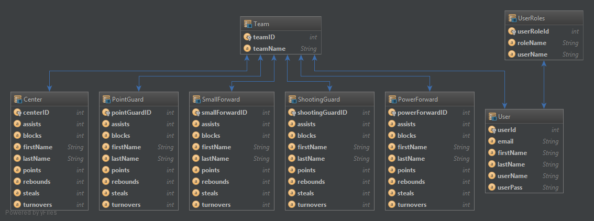

# Database Design for Fantasy Basketball Builder

* Users can have multiple teams

* Teams pull players by ID and fill slots of "player one, player two, etc..." this way

* players populate by type with player tables, this allows for easy querying and organizing

### User Team table contains these fields
* Team ID
* 5 Player Fields
* Team name
* User ID

### Point Guard, Shooting Guard, Center, Power Forward, Small Forward table contains these fields
* ID (corresponding to table name)
* First Name
* Last Name
* Total Points
* Assists
* Rebounds
* Steals
* Blocks
* Turnovers
* Total Fantasy Points

### Users table contains these fields
* User ID
* First Name
* Last Name
* User Name
* Password
* Email

### User Roles table contains these fields
* Role ID
* Role Name
* User ID
* Username
